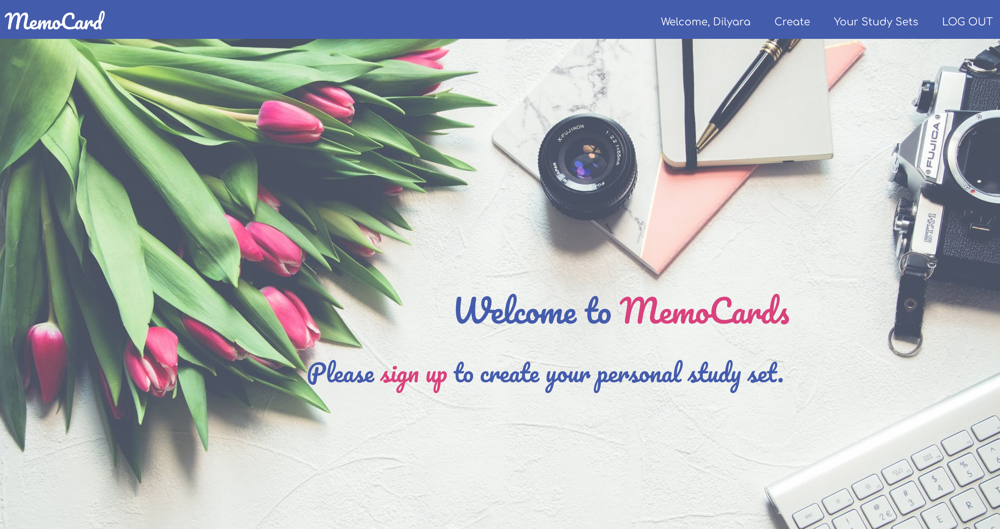

# MemoCards 

## Description
Inspired by my favorite flashcards app - Quizlet.
MemoCards is a full-stack web application which helps to revise new words using flashcards.

## Screenshot

## Technologies Used
 * HTML
 * CSS
 * Javascript
 * Node.js
 * Heroku
 * React JS
 * Mongoose
 * MongoDB
 * Express.js

 ## API Endpoints

 | HTTP method | Endpoint | CRUD |
| ------------ |:-------------:| -----:|
| GET | /display | getAllStudySets |
| GET | /flashcards/:id' | getOneStudySet |
| POST | /create | createStudySet |

 ## Links
 * [Trello](https://trello.com/b/9enkrkJN/memocards)
 * Check the app - [MemoCards](https://memocard.herokuapp.com/) 

## Future features (ice box)
 * Consume a third-party API (so the user is able to see auto translation of english words)
 * Mobile friendly
 * Upload photos
 * See other user's study sets
 * Like and add other user's study sets into my collection of study sets
